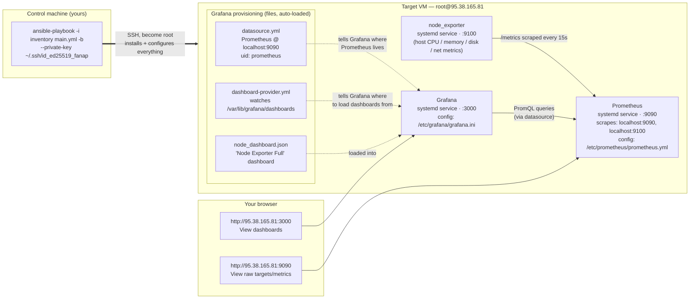

# Scenario 2 — Ansible


## DO NOT CHANGE 
Do not change the `inventory/` folder structure.
Put `ansible_user` and `ansible_host` in `inventory/inventory/monitoring.yml`.

## Option 1 — given VM

Use the **second** SSH target from https://auth.fanap.kubelog.ir

Then run:

```bash
python -m venv .venv
source .venv/bin/activate
pip install -r requirements.txt
ansible-playbook -i inventory main.yml -b --private-key ~/.ssh/id_ed25519_fanap
```

## Option 2 — Vagrant

```bash
vagrant up
```

Set inventory to the Vagrant user and IP (`vagrant` / `192.168.56.10`).
Keep this `Vagrantfile` in the repo.

You can also use the Vagrant layout from [ansible_tutorial](https://github.com/fanapcampus/ansible_tutorial).

The code must run. I will run what you leave here.

# Monitoring Stack — System Diagram



## What each arrow means

| Arrow | Meaning |
|---|---|
| Control → VM | Ansible connects over SSH as `root`, runs the `monitoring` role, installs and starts all three services |
| node_exporter → Prometheus | Prometheus scrapes `/metrics` from node_exporter every 15s (`job: node_exporter`) |
| Prometheus → Prometheus (self) | Prometheus also scrapes its own `/metrics` (`job: prometheus`) |
| Provisioning files → Grafana | Read once on startup/restart; wire up the datasource and auto-load the dashboard — no manual UI clicks needed |
| Grafana → Prometheus | Every dashboard panel query goes out live over the `Prometheus` datasource (PromQL) |
| Browser → Grafana / Prometheus | You view the dashboard at `:3000`; you can view raw scrape targets/metrics at `:9090` |

## Port summary

| Component | Port | Reachable from |
|---|---|---|
| node_exporter | 9100 | localhost only (scraped by Prometheus) |
| Prometheus | 9090 | all interfaces |
| Grafana | 3000 | all interfaces |