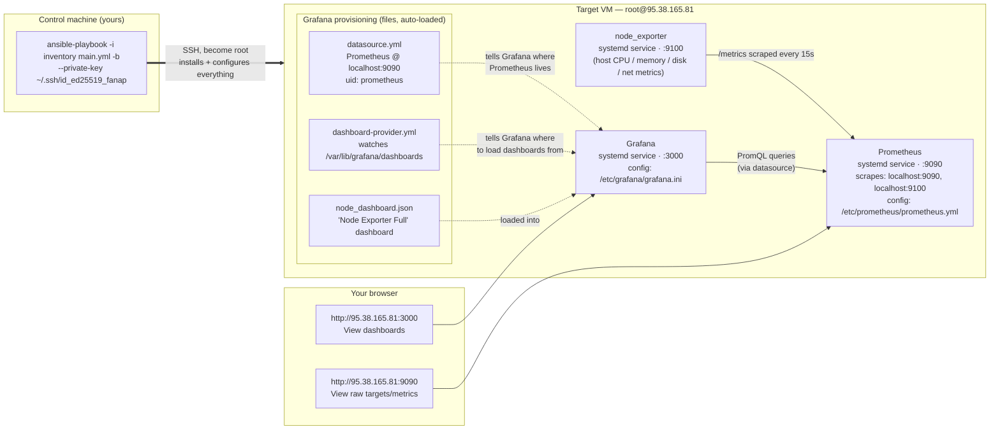

# Monitoring Stack — Generated Files

## What was added

```
inventory/inventory/monitoring.yml     # target host (unchanged inventory/ structure)
roles/monitoring/
├── defaults/main.yml                  # versions, ports, paths
├── handlers/main.yml                  # service restart handlers
├── tasks/
│   ├── main.yml                       # entry point, includes the three files below
│   ├── node_exporter.yml
│   ├── install_prometheus.yml
│   └── grafana.yml
├── templates/
│   ├── node_exporter.service.j2
│   ├── prometheus.yml.j2              # scrape config
│   ├── prometheus.service.j2
│   ├── datasource.yml.j2              # Grafana → Prometheus datasource
│   └── dashboard-provider.yml.j2      # tells Grafana where to load dashboards from
└── files/
    └── node_dashboard.json            # the CPU/Memory dashboard itself
```

Nothing in `main.yml`, `ansible.cfg`, `requirements.txt`, or `Vagrantfile` was
changed — `main.yml` already targeted `hosts: monitoring` and role
`monitoring`, so the new role and inventory group just had to match those
names.

## Inventory

`inventory/inventory/monitoring.yml` defines one host, `monitoring-01`, in
the `monitoring` group:

| Variable        | Value           |
|------------------|-----------------|
| `ansible_host`   | `95.38.165.81`  |
| `ansible_user`   | `root`          |

## What the role does

Run order (`roles/monitoring/tasks/main.yml`):

1. **Base packages** — `curl`, `tar`, `apt-transport-https`,
   `software-properties-common`, `gnupg2` (needed to add Grafana's apt repo).
2. **node_exporter** (`tasks/node_exporter.yml`)
   - Creates a dedicated `node_exporter` system user/group.
   - Downloads the official binary release from GitHub, matching the
     target's CPU architecture (`amd64`/`arm64`).
   - Installs it to `/usr/local/bin/node_exporter`.
   - Runs it as a systemd service listening on **`:9100`**.
3. **Prometheus** (`tasks/install_prometheus.yml`)
   - Creates a dedicated `prometheus` system user/group.
   - Downloads the official binary release from GitHub.
   - Installs `prometheus`/`promtool` to `/usr/local/bin`, config to
     `/etc/prometheus/prometheus.yml`, data to `/var/lib/prometheus`.
   - Scrape config (`templates/prometheus.yml.j2`) scrapes itself
     (`localhost:9090`) and node_exporter (`localhost:9100`) every 15s.
   - Runs it as a systemd service listening on **`:9090`**.
4. **Grafana** (`tasks/grafana.yml`)
   - Adds Grafana's official apt repo + GPG key, installs the `grafana`
     package.
   - Sets `http_port = 3000` in `/etc/grafana/grafana.ini`.
   - Provisions a **Prometheus datasource** (`templates/datasource.yml.j2`)
     pointing at `http://localhost:9090`, set as default, fixed
     `uid: prometheus`.
   - Provisions a **dashboard provider** (`templates/dashboard-provider.yml.j2`)
     watching `/var/lib/grafana/dashboards`.
   - Copies `files/node_dashboard.json` into that folder — Grafana loads it
     automatically on startup, no manual import needed.
   - Runs it as a systemd service listening on **`:3000`**.

The node_exporter and Prometheus install steps check the currently
installed binary version first and skip the download/extract/copy steps if
it already matches `defaults/main.yml`, so re-running the playbook is fast
and idempotent. All three services are installed via `systemd`, enabled on
boot, and restarted automatically (via handlers) whenever their config or
binary changes.

## Dashboard: "Node CPU & Memory"

Two panels, both time series, both backed by the Prometheus datasource:

| Panel            | Query |
|-------------------|-------|
| CPU Usage (%)     | `100 - (avg by (instance) (rate(node_cpu_seconds_total{mode="idle"}[5m])) * 100)` |
| Memory Usage (%)  | `(1 - (node_memory_MemAvailable_bytes / node_memory_MemTotal_bytes)) * 100` |

Both are 0–100% gauges over a 1h window, refreshing every 10s.

## Ports summary

| Service       | Port | Listens on |
|---------------|------|------------|
| node_exporter | 9100 | `localhost` (scraped by Prometheus only) |
| Prometheus    | 9090 | all interfaces |
| Grafana       | 3000 | all interfaces |

## Variables you can override

Set any of these in `group_vars/monitoring.yml`, `-e`, or by editing
`roles/monitoring/defaults/main.yml`:

```yaml
prometheus_version: "2.53.1"
node_exporter_version: "1.8.2"
prometheus_port: 9090
node_exporter_port: 9100
grafana_port: 3000
```

## Running it

```bash
python3 -m venv .venv
source .venv/bin/activate
pip install -r requirements.txt
ansible-playbook -i inventory main.yml -b --private-key ~/.ssh/id_ed25519_fanap
```

After it finishes:

- Prometheus UI: `http://95.38.165.81:9090` → Status → Targets should show
  `prometheus` and `node_exporter` both `UP`.
- Grafana: `http://95.38.165.81:3000` (default login `admin`/`admin`,
  Grafana will prompt a password change) → the "Node CPU & Memory"
  dashboard is already there, and Connections → Data sources already lists
  "Prometheus" as default — no manual setup required for either.

## Assumptions / things to verify on the real host

- Target OS is Debian/Ubuntu (`apt` is used throughout).
- Target has outbound internet access to GitHub (binaries) and
  `apt.grafana.com` (Grafana package).
- Ports 9090, 9100, and 3000 aren't already in use or blocked by a firewall
  you'd need for external access to Prometheus/Grafana UIs.

  # Monitoring Stack — System Diagram



## What each arrow means

| Arrow | Meaning |
|---|---|
| Control → VM | Ansible connects over SSH as `root`, runs the `monitoring` role, installs and starts all three services |
| node_exporter → Prometheus | Prometheus scrapes `/metrics` from node_exporter every 15s (`job: node_exporter`) |
| Prometheus → Prometheus (self) | Prometheus also scrapes its own `/metrics` (`job: prometheus`) |
| Provisioning files → Grafana | Read once on startup/restart; wire up the datasource and auto-load the dashboard — no manual UI clicks needed |
| Grafana → Prometheus | Every dashboard panel query goes out live over the `Prometheus` datasource (PromQL) |
| Browser → Grafana / Prometheus | You view the dashboard at `:3000`; you can view raw scrape targets/metrics at `:9090` |

## Port summary

| Component | Port | Reachable from |
|---|---|---|
| node_exporter | 9100 | localhost only (scraped by Prometheus) |
| Prometheus | 9090 | all interfaces |
| Grafana | 3000 | all interfaces |